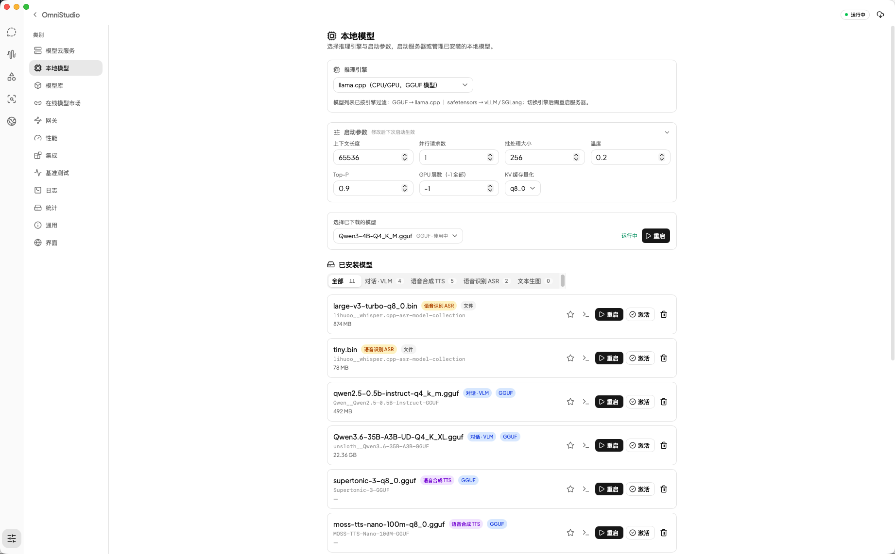
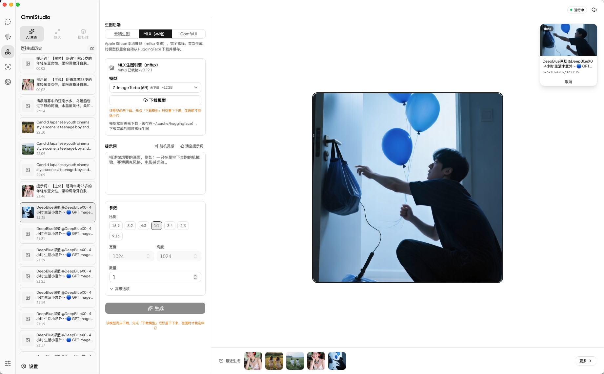
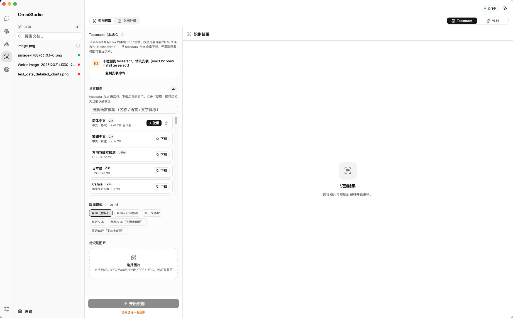
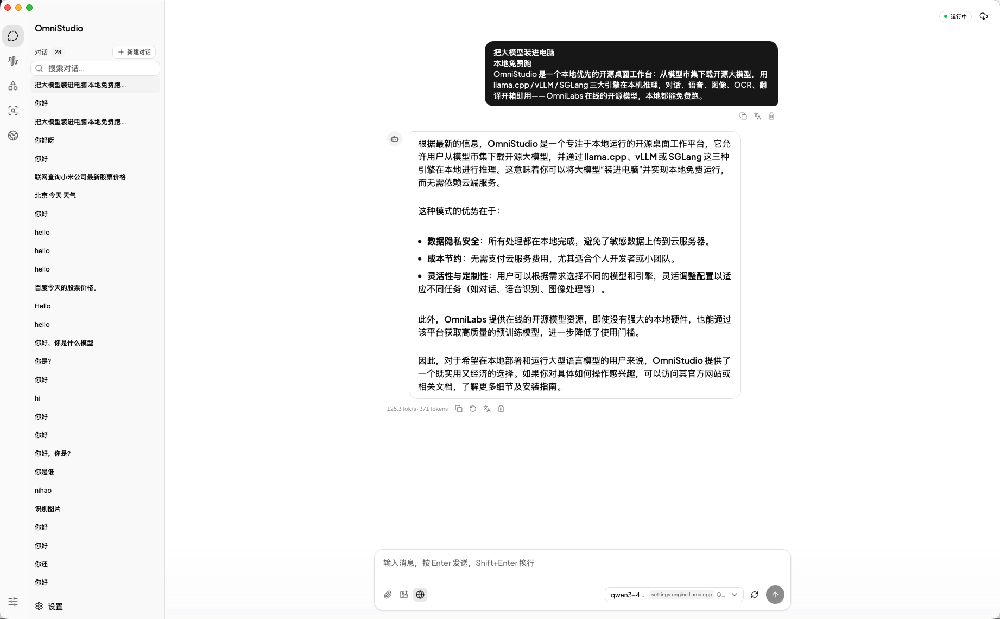

<p align="center">
  
</p>

<h1 align="center">OmniStudio</h1>

<p align="center">
  <b>EN</b> — A desktop workstation for local LLMs: manage models, run inference servers, and build with Chat / Voice / Image / OCR / Translate apps — all local-first.<br/>
  <b>中文</b> — 本地大模型一体化桌面工作台：管理模型、运行推理服务，内置对话 / 语音 / 图片 / OCR 应用，全程本地优先。
</p>

<p align="center">
  <a href="https://kunpengtalk.com">Website 官网</a> ·
  <a href="https://kunpengtalk.com/assets/kunpengtalk-studio-demo.mp4">Demo 演示</a> ·
  <a href="https://github.com/kunpengtalk/OmniStudio/releases/latest">Download 下载</a> ·
  <a href="./CHANGELOG.md">Changelog 更新日志</a>
</p>

<p align="center">
  ⭐ <a href="https://github.com/kunpengtalk/OmniStudio">Star</a> · License: <a href="LICENSE">MIT</a> · Author: 鲲鹏Talk
</p>

---

## 📸 Screenshots / 界面预览

<p align="center">OmniStudio 界面一览 / A quick look at OmniStudio.</p>

<table>
  <tr>
    <th align="center">首页 Home</th>
    <th align="center">模型下载 Model Download</th>
  </tr>
  <tr>
    <td></td>
    <td></td>
  </tr>
  <tr>
    <th align="center">对话 Chat</th>
    <th align="center">对话 · 联网检索 Web Search</th>
  </tr>
  <tr>
    <td></td>
    <td></td>
  </tr>
</table>

---

## ✨ Features / 功能特性

### Model hub 模型市集

- **Search & browse 搜索浏览** — ModelScope model search with repo file listings, model details (params, size, downloads, license, tags). ModelScope 模型搜索、仓库文件列表与详情页。
- **Full-format downloads 全格式下载** — GGUF (llama.cpp), safetensors (vLLM / SGLang), bin/pt/ckpt/onnx; single file or whole-repo "download all"; HuggingFace source for audio.cpp GGUF models. 支持各权重格式，单文件或整仓下载，audio.cpp GGUF 走 HuggingFace 源。
- **Download manager 下载管理** — Task queue with parallel downloads, pause / resume / cancel, byte-accurate resumable transfer (HTTP 206), favorites, and multi-directory model storage. 队列并发下载、暂停/继续/取消、断点续传、收藏与多目录模型库。
- **Capability categories 按能力分类** — Chat / TTS / ASR / Image / Other, auto-classified from model metadata and persisted, surfaced as badges and filters. 自动识别并持久化分类，徽章与筛选。

### Inference engines 推理引擎

- **Unified runtime 统一运行时** — llama.cpp (default: GGUF from local files or HuggingFace, GPU offload, KV cache quantization, multimodal mmproj), vLLM, and SGLang behind one `Runtime` abstraction with hot engine switching. 三引擎统一抽象，支持热切换；llama.cpp 为默认引擎。
- **Remote mode 远程模式** — Directly connect any OpenAI-compatible endpoint (base URL / API key / model) with connection testing. 直连任意 OpenAI 兼容端点并测试连接。
- **Unified gateway 统一网关** — One local endpoint that routes requests to the right backend (local inference server or a cloud OpenAI-compatible API) and speaks three protocols: OpenAI Chat Completions, OpenAI Responses, and Anthropic Messages — including bidirectional tool calling. Optional API-key auth with a copyable key and interactive OpenAPI docs. 本地统一网关：按模型路由到本地 / 云端后端，同时提供 OpenAI Chat / Responses 与 Anthropic Messages 三套协议（含工具调用），可选 API Key 鉴权与在线文档。
- **Endpoints 服务端点** — Chat Completions `/v1`, Responses, Anthropic Messages, `/health`, `/metrics`, one-click copy in settings. 设置页展示端点并一键复制。

### Five built-in apps 五个内置应用

- **Chat 对话** — Streaming responses with reasoning display, image attachments (multimodal), web search (Bing / DuckDuckGo / Tavily, results injected as context with sources), and text-file attachments (whitelisted text/code formats wrapped into context); auto-titled conversations, session isolation per app, usage tracked to the dashboard. 流式回复 + 推理过程展示、图片多模态输入、联网检索（多服务商、结果注入上下文并标注来源）、文本附件（白名单格式注入上下文）、自动标题、按应用隔离会话、用量统计。
- **Voice 语音** — TTS with multiple sources: audio.cpp local C++ engine (GGUF models, Metal accelerated, one-click install), Edge-TTS, and OpenAI-compatible TTS servers; voice cloning with a clone library; ASR via whisper.cpp (one-click install), audio.cpp, or OpenAI-compatible transcription. Everything logged as records with an embedded player. 多来源 TTS（audio.cpp 本地引擎 / Edge-TTS / OpenAI 兼容）+ 声音克隆 + 多引擎 ASR（whisper.cpp / audio.cpp / OpenAI 兼容），记录库内嵌播放器。
- **OCR 文档识别** — Two engines: Tesseract (local C++, multilingual LSTM language packs, word/line bounding boxes) and VLM (Chandra / GLM-OCR / LightOnOCR-class models on the inference server). Upload PDF / PNG / JPG / WebP / TIFF / BMP / HEIC and get structured markdown — GFM tables, KaTeX math, code blocks, captions, and bounding-box-cropped image regions — with a document queue, search and browsing. The extraction workspace uses a two-pane layout (left config + right results). 双引擎：本地 Tesseract（多语言包、词级 bbox）与 VLM；输出结构化 Markdown，文档队列与检索；提取页为双栏布局。
- **Image 图片** — Image generation via cloud OpenAI-compatible APIs, ComfyUI, or the local MLX (mflux) engine on Apple Silicon. MLX model weights are pre-downloaded with live progress before generation. 生图：云端 OpenAI 兼容 API / ComfyUI / 本地 MLX（mflux）引擎；MLX 权重预下载并实时显示进度。
- **Translate 翻译** — Translate text through the current chat model (local inference server or any OpenAI-compatible API) across 22 languages, with source auto-detection, language swap, and one-click copy. 通过当前对话模型进行多语言互译，支持源语言自动检测、交换与一键复制。

### Ops & telemetry 运维与遥测

- **Live dashboard 实时仪表盘** — Prefill / generation tokens and speed (tok/s), request counts, active models, memory and CPU load, server uptime, model disk usage — polled every 2s. 吞吐/速度/请求数/活跃模型/内存/CPU/运行时长/磁盘占用，2 秒轮询。
- **Benchmarks 基准测试** — Context-length sweeps (1K–200K) with TTFT / TPOT / TPS, results table and charts, for local or remote servers. 上下文扫描与 TTFT/TPOT/TPS 图表。
- **Server logs 日志查看** — Live tail with ANSI colors, auto-scroll, truncation guard, copy / clear. 实时日志、ANSI 着色、复制/清空。
- **CLI integrations CLI 集成** — Generated launch commands for Claude Code (local / cloud, Opus-Sonnet-Haiku model mapping), Codex, OpenCode, OpenClaw, Hermes, Pi and Copilot CLI, each bound to a default model. 为各 CLI 工具生成启动命令并绑定默认模型。
- **Updates & i18n 更新与多语言** — Stable / beta channels with in-app updates, setup wizard, zh / en UI language, per-app session stores in SQLite. 稳定/测试更新通道、引导向导、中英界面、SQLite 持久化。

## 🚀 Getting Started / 快速开始

**Requirements 环境要求**

- [Bun](https://bun.sh) 1.3+
- macOS (Apple Silicon); Linux / Windows support coming 支持 macOS（Apple Silicon），Linux / Windows 支持规划中

```bash
bun install

# development with HMR (recommended) / 开发模式（HMR，推荐）
cd apps/studio && bun run dev:hmr

# development without HMR / 开发模式（无 HMR）
cd apps/studio && bun run dev

# build for production / 生产构建
cd apps/studio && bun run build:dev
```

## 🧩 Tech Stack / 技术栈

| Layer 层级 | Technology 技术 |
|---|---|
| Desktop 桌面 | [Electrobun](https://blackboard.sh/electrobun) + Bun |
| Frontend 前端 | React 19, Tailwind, shadcn/ui, Zustand, TanStack Query |
| AI 人工智能 | Vercel AI SDK (`ai`), `@ai-sdk/openai-compatible` |
| Inference engines 推理引擎 | llama.cpp, vLLM, SGLang, OpenAI-compatible |
| Voice & OCR 语音与 OCR | audio.cpp, whisper.cpp, Tesseract, Edge-TTS, VLM |
| Database 数据库 | Drizzle ORM + Bun SQLite |
| Document processing 文档处理 | Sharp, pdfjs-dist, @napi-rs/canvas, Cheerio, Turndown |
| Model hub 模型市集 | ModelScope OpenAPI, HuggingFace |
| Build 构建 | Vite, Turborepo, Bun workspaces |
| Code quality 代码质量 | oxlint, oxfmt |

## 📁 Project Structure / 项目结构

```
apps/
├── studio/                 # Electrobun desktop app / 桌面应用
│   └── src/
│       ├── bun/            # Main process / 主进程
│       │   ├── runtimes/   #   llama.cpp / vLLM / SGLang runtime abstraction 运行时抽象
│       │   ├── vllm/       #   model profiles & endpoints 模型配置与端点
│       │   ├── db/         #   Drizzle schema, migrations, settings 数据库
│       │   └── ...         #   chat, voice, OCR, model hub, downloads, benchmarks, stats, updates
│       │                   #   对话、语音、OCR、模型市集、下载、基准、统计、更新
│       ├── mainview/       # React UI（components, stores, lib）
│       └── shared/         # shared constants, i18n, engine metadata 共享常量 / 国际化 / 引擎元数据
└── landing/                # marketing site (kunpengtalk.com) 官网
```

## 🗺 Roadmap / 路线图

- [x] Model hub: ModelScope / HuggingFace downloads, queue, categories, favorites 模型市集（下载队列 / 分类 / 收藏 / 多目录）
- [x] Unified llama.cpp / vLLM / SGLang runtime + remote OpenAI-compatible API 三引擎统一运行时 + 远程 API
- [x] Chat / Voice / OCR apps with per-app sessions; voice multi-engine TTS/ASR + cloning + records 对话 / 语音（多引擎）/ OCR 应用
- [x] Dashboard, benchmarks, log viewer, CLI integrations, update channels, i18n 仪表盘 / 基准 / 日志 / 集成 / 更新 / 多语言
- [x] Image generation loop for the Image app 图片应用生图闭环
- [ ] Linux and Windows support Linux 与 Windows 支持
- [ ] More document formats (PowerPoint, Word, Excel, etc.) 更多文档格式
- [ ] Memory lifecycle (idle unload, prefault protection), KV cache tiering with SSD offload 内存生命周期与 KV 缓存分层
- [ ] Menu bar / Dock indicators, API key encryption, `omni-studio launch <tool>` 菜单栏指标 / Key 加密 / launch 子命令

## 📄 License / 许可证

[MIT](LICENSE) — Copyright (c) 2026 鲲鹏Talk

---

<p align="center">
  Built by <b>鲲鹏Talk</b> / 由 <b>鲲鹏Talk</b> 打造
</p>
